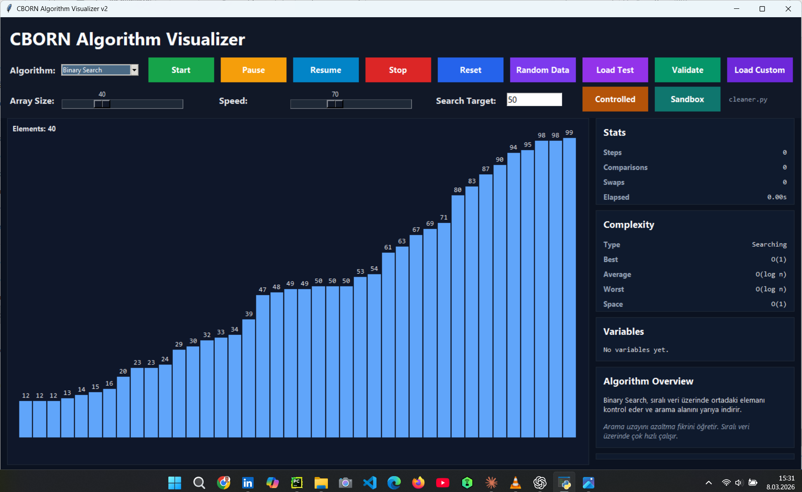

# Cborn Algorithm Visualizer v2

A modern Python-based algorithm visualizer that helps you understand how algorithms work step by step through animation.

This project is designed to make algorithm learning more interactive, visual, and practical. Instead of staring at dry theory like it owes you money, you can actually see comparisons, swaps, searching logic, and execution flow in action.

---

## Features

- Visualize algorithms step by step
- Adjustable animation speed
- Adjustable array/data size
- Clean and modern desktop interface
- Color-based visual feedback for comparisons, swaps, sorted items, and found targets
- Test mode support
- Custom data input support
- Educational algorithm information panel
- Built with Python and Tkinter

---

## Supported Algorithm Types

This project is built to support multiple algorithm categories such as:

### Sorting Algorithms
Examples may include:
- Bubble Sort
- Selection Sort
- Insertion Sort
- Merge Sort
- Quick Sort

### Searching Algorithms
Examples may include:
- Linear Search
- Binary Search

> The exact list depends on the algorithms defined inside the project files.

## Screenshot


## How to Run

1. Make sure Python 3.10+ is installed.
2. Clone the repository.
3. Run the application:
python main.py
```bash

### Project Structure altı
```md
```bash
Cborn_Algorithm_Visualizer_v2/
├── main.py
├── visualizer.py
├── algorithms.py
├── config.py
├── data.py
├── utils.py
├── test_mode.py
└── ...

